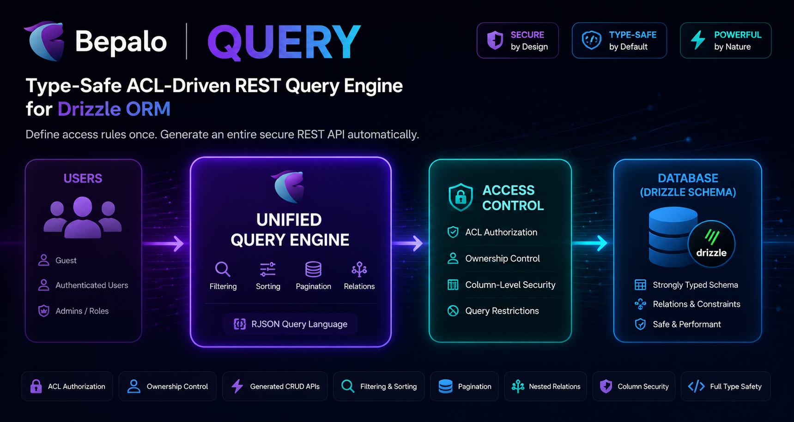

# 🏆 @bepalo/query



[](https://www.npmjs.com/package/@bepalo/query)
[](https://github.com/bepalo/query/actions/workflows/ci.yaml)
[](https://github.com/bepalo/query/actions/workflows/testing.yaml)
[](LICENSE)

<!--  -->

[](test-result.md)

**A type-safe access-control-driven unified RESTful database query engine for backend using Drizzle ORM.**

Bepalo Query automatically generates secure database-backed REST resources directly from your Drizzle schema and ACL definitions.

Instead of writing CRUD endpoints, validation, authorization, role checks, pagination, filtering, relation loading, and result formatting manually, you define access rules once and let the framework generate the API.

## 🎯 Why Bepalo Query?

Traditional applications require building:

- CRUD endpoints
- Validation
- Authentication
- Authorization
- Filtering
- Pagination
- Relation loading
- Error handling

Bepalo Query replaces all of that with a declarative ACL.

Your workflow after project setup becomes:

`( Add/Update Schema )` -> `( Add/Update ACL )` -> `( Query Resource )`

## ✨ Features

- 🔐 Access-control driven authorization
- 🔐 query route definitions for server-side
- 🔐 client builder for client-side
- 🟦 All Typescript type-safe
- 👤 Role-based access control
- 🛡️ Column-level security
- 🛡️ Row-level security
- ⚡ CRUD endpoint
- 🔎 Filtering and sorting
- 📦 Pagination support
- 🌳 Nested relation joining
- 🧩 Query validation
- 📝 Request-body validation
- 💉 Request-body injection/transformation
- 📊 Computed SQL fields
- 🔄 Transaction support
- 🚫 Query restrictions
- 📏 Query depth limits
- 📈 Query size limits
- 🪝 Query hooks: before & after & on-error
- 🚀 Built on top of Drizzle ORM
- 🭄 Scalability

## 🏁 Performance

- Built directly on Drizzle ORM
- No runtime schema generation
- No reflection

Very Fast

## 📑 Table of Contents

- [🎯 Why Bepalo Query?](#-why-bepalo-query)
- [✨ Features](#-features)
- [🏁 Performance](#-performance)
- [🚀 Get Started](#-get-started)
  - [📥 Installation](#-installation)
  - [📦 Quick Start](#-quick-start)
    - [Create the Database and Define the ACL Type](#create-the-database-and-define-the-acl-type)
    - [Create Authentication and Middleware](#create-authentication-and-middleware)
    - [Create a Query Route and Mount It](#create-a-query-route-and-mount-it)
    - [Define the ACL](#define-the-acl)
- [🔧 Client Query Builder](#-client-query-builder)
- [🔑 Authentication](#-authentication)
- [🔐 ACL System](#-acl-system)
  - [Roles](#roles)
  - [The `control` structure](#the-control-structure)
- [📚 Query Language](#-query-language)
  - [Pagination](#pagination)
  - [Select Columns](#select-columns)
  - [Filtering](#filtering)
  - [Multiple Filters](#multiple-filters)
  - [Sorting](#sorting)
  - [Relations](#relations)
- [🛡️ Column Security](#️-column-security)
- [🌐 HTTP Methods](#-http-methods)
  - [GET Handlers](#get-handlers)
  - [POST Handlers](#post-handlers)
  - [PATCH Handlers](#patch-handlers)
  - [DELETE Handlers](#delete-handlers)
  - [OPTIONS and HEAD](#options-and-head)
- [🧮 Computed Fields](#-computed-fields)
- [🚫 Restrict Client Queries](#-restrict-client-queries)
- [🎨 Custom Result Formatting](#-custom-result-formatting)
- [⚠️ Production Recommendations](#️-production-recommendations)
- [📄 License](#-license)
- [🕊️ Thanks and Enjoy](#️-thanks-and-enjoy)
- [💖 Be a Sponsor](#-be-a-sponsor)

## 🚀 Get Started

### 📥 Installation

#### bun

```bash
bun add @bepalo/query
```

#### npm

```bash
npm install @bepalo/query
```

#### pnpm

```bash
pnpm add @bepalo/query
```

### 📦 Quick Start

#### Create the database and Define the `ACL` type

```ts
// src/db/index.ts
import { drizzle } from "drizzle-orm/libsql";
import { createClient } from "@libsql/client";
import { type ACL as IACL } from "@bepalo/query";
import type { CTXUserSession } from "@/auth/middleware";
import * as schema from "./schema";
export * as schema from "./schema";

const client = createClient({ url: process.env.DB_FILE_NAME! });
export const db = drizzle(client, { schema });

export type UserRoles = "user" | "admin";
export type Database = typeof db;
export type Query = typeof db.query;
export type Schema = typeof schema;

// A good place to define ACL
export type ACL<XContext = {}> = IACL<
  UserRoles,
  CTXUserSession,
  XContext,
  Schema,
  Database
>;

export default db;
```

#### Create auth and its middleware

```ts
// src/auth/index.ts
import { db, schema } from "@/db";
import { betterAuth } from "better-auth";
import { drizzleAdapter } from "better-auth/adapters/drizzle";

export const auth = betterAuth({
  baseURL: process.env.BETTER_AUTH_URL || "http://localhost:4000",
  secret: process.env.BETTER_AUTH_SECRET || "<better-auth-secret>",

  emailAndPassword: {
    enabled: true,
  },

  database: drizzleAdapter(db, {
    provider: "sqlite",
    schema: schema,
  }),

  user: {
    additionalFields: {
      role: {
        type: "string",
        required: true,
        defaultValue: "user",
        input: false,
      },
    },
  },
});
```

```ts
// src/auth/middleware.ts
import { Status, status, type RequestHandler } from "@bepalo/router";
import { auth } from "@/auth";

export type CTXUserSession = {
  session: typeof auth.$Infer.Session.session;
  user: typeof auth.$Infer.Session.user;
};

export const authenticate = (options?: {
  optional?: boolean;
}): RequestHandler<CTXUserSession> => {
  const optional = options?.optional;
  return async (req, ctx) => {
    // Pass the incoming request headers to Better Auth
    const session = await auth.api.getSession({
      headers: req.headers,
    });
    // Validate session
    if (!optional && !session) {
      return status(Status._401_Unauthorized);
    }
    if (session != null) {
      ctx.session = session.session;
      ctx.user = session.user;
    }
  };
};
```

#### Create a Query route and mount it

```ts
// src/index.ts
import { createQueryRoute } from "@bepalo/query";
import { authenticate, type CTXUserSession } from "@/auth/middleware";
import { auth } from "@/auth"; // better-auth
import { db, schema, type UserRoles } from "@/db";
import acl from "@/db/acl";

// returns an object of the request handlers for
//   the http methods HEAD, GET, POST, PATCH, and DELETE
const queryRoute = createQueryRoute<UserRoles, CTXUserSession>({
  idParam: "id",
  acl,
  database: db,
  schema,
  defaults: {
    maxDepth: 2,
    maxLimit: 1000,
  },
  onError: (error) => console.error(error),
  session: {
    parser: authenticate({ optional: true }),
    getRole: (_req, { user }) => user?.role as UserRoles,
  },
});

// serve
const server = Bun.serve({
  port: parseInt(process.env.PORT || "4000"),
  routes: {
    "/api/auth/*": auth.handler, // better-auth
    "/query/:id": queryRoute, // bepalo-query
  },
});
console.log(`Backend server listening on ${server.url}`);
```

Your resources will now be available at `/query/<resource>`

#### Define the ACL - Access Control

The main ACL file

```ts
// src/db/acl/index.ts
import { ACL } from "@db";
import postACL from "./post.acl";

export default {
  ...postACL,
  // ...otherACLs
} as ACL;
```

---

```ts
// src/db/acl/post.acl.ts
import { ACL } from "@db";

export default {
  posts: {
    table: "post",

    control: {
      GET: {
        mine: {
          where: ({ session }, post, { eq }) => eq(post.userId, session.userId); // row-level security
        },
      },
    },
  },
} as ACL;
```

This enables and defines access of

```http
GET /query/posts
```

Internally:

```ts
db.query.post.findMany(...)
```

---

You are all set!

## 🔧 Client Query Builder

Building RJSON manually becomes tedious.

The client library provides a fully typed API.

### Create Client

```ts
import { createQuery } from "@bepalo/query/client";
import type { Schema, Database } from "@db"; // importing only types from backend is safe

const q = createQuery<Schema, Database>();
```

### Build Queries

NOTE: the query builder will return a URLSearchParams instance for the
GET method of the specified table not the resource.
This is because exposing the ACL in the frontend is a bad idea.

```ts
const query = q.Get<"fruit">({
  select: {
    columns: {
      id: true,
      name: true,
    },
  },
});
```

Use:

```ts
fetch(`/query/fruits?${query}`);
```

### Nested Relations

```ts
const query = q.Get<"fruit">({
  select: {
    with: {
      basket: {
        columns: {
          name: true,
        },

        with: {
          fruit: {
            columns: {
              name: true,
            },
          },
        },
      },
    },
  },
});
```

Everything is inferred directly from Drizzle relations.

Invalid columns become TypeScript errors.

Invalid relations become TypeScript errors.

## 🔑 Authentication

You can plug in your own authentication method through the provided `session` parameter:

- `session.parser` which parses the session from the request into the context
- `session.getRole` which gets the role of the user from the parsed session.

The query engine only cares about the role. It is up to you how to manage the session context.

```ts
session: {
  parser: authenticate({ optional: true }),

  getRole: (req, ctx) =>
    ctx.user?.role as UserRole,
}
```

## 🔐 ACL System

The ACL is the heart of Bepalo Query.

```ts
{
  posts: { // resource alias. can be any valid url path-part
    table: "post", // valid table name from schema

    control: {
      GET: {},
      POST: {},
      PATCH: {},
      DELETE: {}
    }
  }
} as ACL;
```

Every request passes through ACL evaluation before reaching the database.

---

ACL definitions can be separated into files and imported to a common ACL.

```ts
import type { ACL } from "@/db";
import userACL from "./user.acl";
import postACL from "./post.acl";

export default {
  ...userACL,
  ...postACL,
} as ACL;
```

### Roles

#### guest

Unauthenticated users.

```ts
GET: {
  guest: {
  }
}
```

#### mine

Authenticated ownership access. Don't forget to add row-level security to limit
query to the current authenticated user.

```ts
GET: {
  mine: {
    where: ({ session }, post, { eq }) => eq(post.userId, session.userId); // row-level security
  }
}
```

#### all

Available regardless of authentication.

```ts
GET: {
  all: {
  }
}
```

#### User-defined roles

```ts
type UserRoles = "admin" | "editor" | "moderator";
```

```ts
GET: {
  moderator: {
  }
}
```

### The `control` Structure

A control entry supports the following capabilities:

```ts
GET: {
  guest : {
    forbidQuery?: {...};

    select?: ...;

    extras?: {...};

    where?: (...);

    orderBy?: {...};

    with?: {...};

    validateBody?: (...); // only available in POST and PATCH

    injectBody?: (...); // only available in POST and PATCH

    beforeQuery?: (...);

    afterQuery?: (...);

    onQueryError?: (...);
  }
}
```

#### forbidQuery

Restricts which query capabilities clients may use.

```ts
GET: {
  all: {
    forbidQuery: {
      columns: true,
      where: true,
      orderBy: true,
      with: true,
      limit: true,
      offset: true,
    }
  }
}
```

Attempting to use a forbidden query feature automatically returns:

```http
400 Bad Request
```

Available options:

```ts
forbidQuery: {
  columns?: boolean;
  offset?: boolean;
  limit?: boolean;
  where?: boolean;
  orderBy?: boolean;
  with?: boolean;
}
```

#### select

Controls column-level access.

##### Allow-list Mode

```ts
select: {
  mode: true,

  columns: new Set([
    "id",
    "title"
  ])
}
```

Only listed columns may be queried.

##### Deny-list Mode

```ts
select: {
  mode: false,

  columns: new Set([
    "password",
    "secret"
  ])
}
```

Listed columns are hidden from clients.

##### Full Access

```ts
select: true;
```

Allow all columns.

##### Disable Selection

```ts
select: false;
```

No table columns are returned.

Useful when returning only computed fields.

#### extras

Adds computed SQL fields.

```ts
import { sql } from "drizzle-orm";

GET: {
  all: {
    select: false,

    extras: {
      count: sql`count(*)`.as("count")
    }
  }
}
```

Result:

```json
{
  "count": 42
}
```

#### where

Adds server-side row-level security.

The generated condition is always enforced by the server.

```ts
GET: {
  mine: {
    where: ({ session }, post, { eq }) => eq(post.userId, session.userId);
  }
}
```

This condition is automatically combined with any client-provided filters.

```sql
(userId = currentUser)
AND
(client filters)
```

#### orderBy

Applies a fixed server-side ordering.

```ts
GET: {
  all: {
    orderBy: {
      createdAt: "desc",
    }
  }
}
```

Multiple fields:

```ts
orderBy: {
  updatedAt: "desc",
  createdAt: "asc"
}
```

Supported values:

```ts
type Order = "asc" | "desc" | 1 | -1;
```

#### with

Controls relation loading.

Relations can have their own nested ACL configuration.

```ts
GET: {
  all: {
    with: {
      user: {
        select: {
          mode: true,
          columns: new Set([
            "id",
            "name"
          ])
        }
      }
    }
  }
}
```

Nested relations are supported.

```ts
GET: {
  all: {
    with: {
      user: {
        with: {
          profile: {
            select: true
          }
        }
      }
    }
  }
}
```

#### validateBody

Available only for:

- POST
- PATCH

Used to validate and parse incoming request bodies.

```ts
POST: {
  mine: {
    validateBody: (body) =>
      createInsertSchema(post).pick("title", "content").assert(body);
  }
}
```

Returning validation errors automatically rejects the request.

#### injectBody

Available only for:

- POST
- PATCH

Used to transform request bodies before database operations.

```ts
POST: {
  mine: {
    injectBody: (body, { session }) => ({
      ...body,
      userId: session.userId,
    });
  }
}
```

Client sends:

```json
{
  "title": "Hello"
}
```

Database receives:

```json
{
  "title": "Hello",
  "userId": "123"
}
```

#### beforeQuery

Runs before the database operation executes.

Useful for:

- auditing
- rate limiting
- metrics
- custom authorization
- transaction preparation

```ts
GET: {
  admin: {
    beforeQuery: async (ctx) => {
      // tx.insert(...); // insert into a related table
      /*
       * Eg. You could insert an organization admin when creating an organization with body
       *
       * { "name": "Barber Shop", ..., "admin": { "name": "Natnael", "email": "me@example.com", ... } }
       *
       * The 'admin' entry would be filtered out aat injection phase and the admin data be stored in context.
       * Then the admin would be registered as a user in the before query phase.
       */
    };
  }
}
```

#### afterQuery

Runs after a successful database operation.

Useful for:

- analytics
- cache invalidation
- event publishing
- logging

```ts
GET: {
  admin: {
    afterQuery: async (ctx) => {
      // tx.insert(...); // insert into a related table
      // tx.update(...); // update a related table
    };
  }
}
```

#### onQueryError

Handles errors produced while executing the database query.

```ts
GET: {
  all: {
    onQueryError: async (error, ctx) => {
      console.error(error);
    };
  }
}
```

Custom responses may be returned.

```ts
onQueryError: (error) =>
  Response.json(
    {
      error: "Database failure",
    },
    {
      status: 500,
    },
  );
```

#### Example

```ts
GET: {
  mine: {
    select: {
      mode: true,
      columns: new Set([
        "id",
        "name"
      ])
    },

    where: ({ session }, post, { eq }) =>
      eq(post.userId, session.userId),

    orderBy: {
      createdAt: "desc"
    },

    with: {
      user: {
        select: {
          mode: false,
          columns: new Set([
            "password",
            "token"
          ])
        },
      }
    },

    beforeQuery: async (ctx) => {
      // tx.insert(...); // insert into a related table
    },

    afterQuery: async (ctx) => {
      // tx.insert(...); // insert into a related table
      // tx.update(...); // update a related table
    },

    onQueryError: async (error) => {
      // log error
      console.error(error);
      // or return a custom error response
      return json({ error: error.message ?? "Database error" }, { status: 500 });
    }
  }
}
```

## 📚 Query Language

Bepalo Query uses RJSON-based selectors. Please refer to [RJSON library](https://www.npmjs.com/package/@bepalo/rjson) for more information.

### Pagination

```http
?select=(limit:10)
```

```http
?select=(limit:10,offset:20)
```

### Select Columns

```http
?select=(columns:(id:T,title:T))
```

### Filtering

```http
?select=(where:(title.like:'Hello%'))
```

### Multiple Filters

`AND`

```http
?select=(where:(title.like:'Hello%',published.eq:T))
```

```SQL
WHERE title LIKE 'Hello%' AND published = true
```

`OR`

```http
?select=(where:_((title.like:'Hello%'),(published.eq:T))_)
```

```SQL
WHERE title LIKE 'Hello%' OR published = true
```

Sum of products

```http
?select=(where:_((title.like:'Hello%',published.eq:T),(createdAt.gte:1234567000))_)
```

```SQL
WHERE (title LIKE 'Hello%' AND published = true) OR createdAt >= 1234567000
```

### Sorting

```http
?select=(orderBy:(updatedAt:asc,createdAt:desc))
```

```SQL
ORDER BY updatedAt ASC, createdAt DESC
```

### Relations

```http
?select=(with:(user:T))
```

Nested:

```http
?select=(with:(user:(columns:(id:T,name:T))))
```

Or using RJSON mapped arrays

```http
?select=(with:(user:(columns:~T(id,name)~)))
```

## 🛡️ Column Security

### Whitelist Mode

```ts
select: {
  mode: true,

  columns: new Set([
    "id",
    "title"
  ])
}
```

Only listed columns may be queried.

### Blacklist Mode

```ts
select: {
  mode: false,

  columns: new Set([
    "password",
    "secret"
  ])
}
```

Sensitive fields are automatically removed.

## 🌐 HTTP Methods

### GET Handlers

Gets records

```ts
GET: {
  mine: {
    select: {
      mode: false,
      columns: new Set(["createdAt","updatedAt"])
    }
    where: ({ session }, post, { eq }) => eq(post.userId, session.userId); // row-level security
  }
  admin: {
    // select: true, // by default all columns will be selected
  }
}
```

### POST Handlers

Create records.

#### Validation

Used to validate the body before it reaches the database query.

```ts
POST: {
  mine: {
    validateBody: (body) =>
      createInsertSchema(post).pick("title", "body")(body);
  }
}
```

#### Body Injection

Used to transform body before it reaches the database query. Anything is possible.

```ts
POST: {
  mine: {
    injectBody: (body, { session }) => ({
      ...body,
      userId: session.userId,
    });
  }
}
```

Client:

```json
{
  "title": "Hello"
}
```

Database receives:

```json
{
  "title": "Hello",
  "userId": "123"
}
```

### PATCH Handlers

```ts
PATCH: {
  mine: {
    validateBody(...),

    where: ({ session }, post, { eq }) =>
      eq(post.userId, session.userId) // row-level security
  }
}
```

### DELETE Handlers

```ts
DELETE: {
  mine: {
    where: ({ session }, post, { eq }) => eq(post.userId, session.userId); // row-level security
  }
}
```

### OPTIONS and HEAD

The HEAD method is just GET method without a body.  
Use OPTIONS to inspect resource availabilities.

```http
OPTIONS /query/posts?mine|guest
```

Response:

```http
Allow: OPTIONS,HEAD,GET,POST
```

## 🧮 Computed Fields

Add extra columns using SQL expressions.

```ts
METHOD: {
  select: false, // no columns will be selected because {} is empty
  extras: {
    count: sql`count(*)`.as("count"), // row-level security
  }
}
```

Result:

```json
{
  "count": 53
}
```

## 🚫 Restrict Client Queries

You can disable any of these query capabilities from the ACL.

```ts
METHOD: {
  forbidQuery: {
    columns: true,
    where: true,
    orderBy: true,
    with: true,
    limit: true,
    offset: true,
  }
}
```

Invalid usage automatically returns:

```http
400 Bad Request
```

## 🎨 Custom Result Formatting

Default:

```json
{
  "count": 10,
  "posts": [...]
}
```

Custom:

```ts
formatResult: (req, ctx) =>
  json({
    rowsAffected: ctx.result.rowsAffected ?? null,
    total: ctx.result.total ?? null,
    customCount: ctx.result.count,
    custom: ctx.result.rows,
  });
```

```json
{
  "rowsAffected": null,
  "total": null,
  "customCount": 0,
  "custom": [...]
}
```

## ⚠️ Production Recommendations

### Always Set Maximum Limits

```ts
defaults: {
  maxLimit: 20;
}
```

### Always Set Maximum Depth

```ts
defaults: {
  maxDepth: 2;
}
```

### Enforce Row-Level Security Server-side

Prefer:

```ts
where: ({ session }, table, { eq }) => eq(table.userId, session.userId);
// this will be AND'ed with the users query 'where' filters
```

### Validate Every Body for POST and PATCH

```ts
validateBody(...)
```

### Hide Sensitive Data

```ts
select: {
  mode: false,

  columns: new Set([
    "password",
    "token",
    "secret"
  ])
}
```

## 📄 License

[MIT](./LICENSE)

## 🕊️ Thanks and Enjoy

If Bepalo Query helps your project, consider starring the repository and sharing it with others.

## 💖 Be a Sponsor

Support development and future improvements.

[](https://ko-fi.com/natieshzed)
